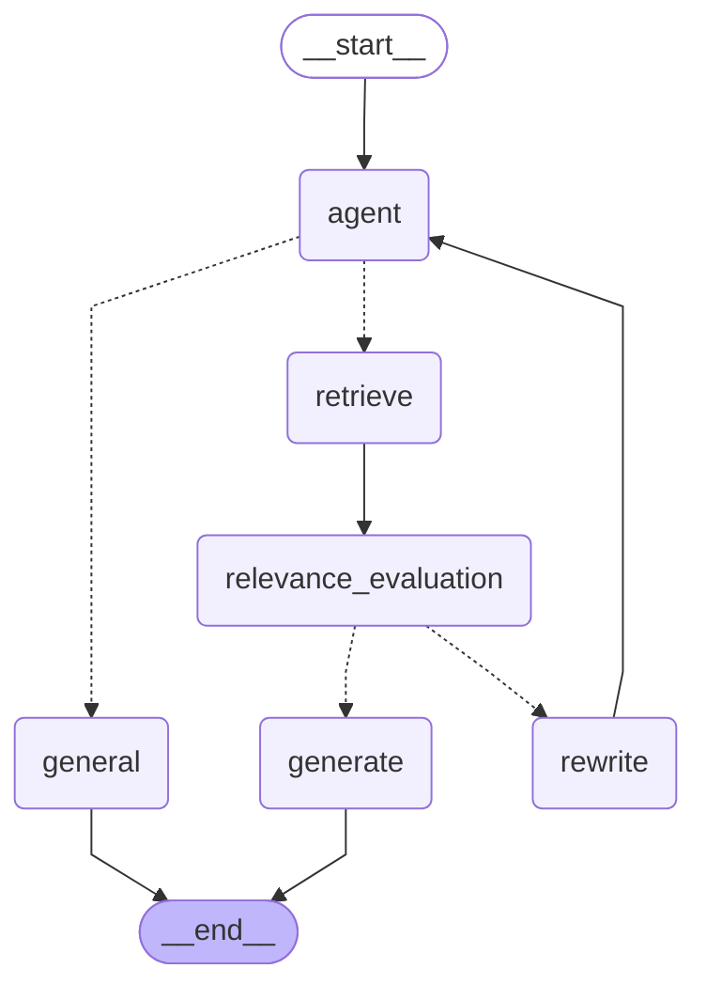

```mermaid
---
config:
  flowchart:
    curve: linear
---
graph TD;
	__start__([<p>__start__</p>]):::first
	agent(agent)
	retrieve(retrieve)
	relevance_evaluation(relevance_evaluation)
	rewrite(rewrite)
	generate(generate)
	general(general)
	__end__([<p>__end__</p>]):::last
	__start__ --> agent;
	agent -.-> general;
	agent -.-> retrieve;
	relevance_evaluation -.-> generate;
	relevance_evaluation -.-> rewrite;
	retrieve --> relevance_evaluation;
	rewrite --> agent;
	general --> __end__;
	generate --> __end__;
	classDef default fill:#f2f0ff,line-height:1.2
	classDef first fill-opacity:0
	classDef last fill:#bfb6fc

```